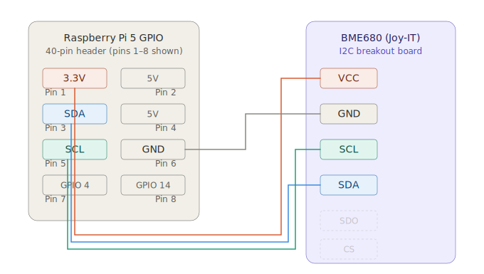
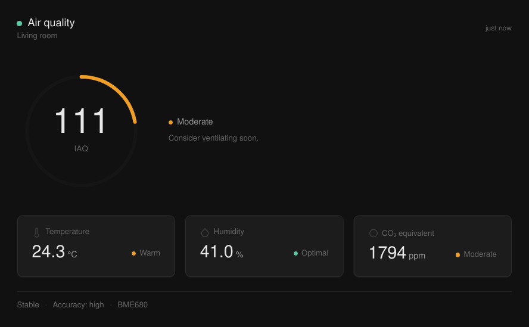

# BME680 Raspberry Pi Driver

A pure Python driver for the Bosch BME680 environmental sensor on Raspberry Pi, with a C bridge to the proprietary Bosch BSEC library for accurate Indoor Air Quality (IAQ) computation.

> **Tested on Raspberry Pi 4 and 5 · Raspberry Pi OS · Python 3.13.5 · GCC 14.2.0 · BSEC 2.6.1.0**

---

## What this is

The BME680 measures temperature, pressure, humidity, and gas resistance. On its own, the raw gas resistance value is not very useful. Bosch's BSEC library turns it into a calibrated IAQ index, CO₂ equivalent, breath VOC equivalent, and more — but BSEC is a proprietary closed-source binary, so integrating it requires a small C bridge.

This project gives you:

- A **pure Python I2C driver** for the BME680, with compensation algorithms implemented directly from the datasheet. No dependency on Adafruit or other third-party driver libraries — only `smbus2`.
- A **lightweight C bridge** (`libbsec_wrapper.so`) that wraps BSEC and exposes it to Python via `ctypes`.
- A **`BsecIAQ` Python class** that drives the full BSEC measurement loop, handles state persistence, and delivers typed results to a callback of your choice.
- A **ready-to-run web dashboard** that streams live air quality data to a browser over SSE — no frontend build step required.

---

## Wiring

Tested with the Joy-IT BME680 breakout board over I2C.



Leave SDO and CS unconnected. The Joy-IT board pulls SDO high, giving an I2C address of `0x77`. If the sensor is not found at startup, the driver automatically retries at `0x76`.

Enable I2C on the Pi if you haven't already:

```bash
sudo raspi-config   # Interface Options → I2C → Enable
```

---

## Setup

> **All steps below must be run on the Raspberry Pi itself.** The BSEC bridge is compiled for ARM and links against the ARM static library — it cannot be cross-compiled on a different machine.

### 1. Install Python dependencies

```bash
pip install smbus2
```

For the web dashboard example, also install Flask:

```bash
pip install flask pyopenssl
```

### 2. Obtain the Bosch BSEC library

BSEC is proprietary and cannot be redistributed here. Download it from Bosch directly:

1. Go to [bosch-sensortec.com/software-tools/software/bme680-software-bsec](https://www.bosch-sensortec.com/software-tools/software/bme680-software-bsec/)
2. Download **BSEC 2.x** (tested against BSEC 2.6.1.0)
3. Unzip the archive directly into the repo root:

```bash
unzip path/to/BSEC_2.x.x.x.zip -d /path/to/repo/bsec
```

After extraction, the following paths must exist:

```
bsec/algo/bsec_IAQ/inc/                                             ← header files
bsec/algo/bsec_IAQ/bin/RaspberryPi/PiFour_Armv8/libalgobsec.a       ← static library
bsec/algo/bsec_IAQ/config/bme680/bme680_iaq_33v_3s_28d/             ← config files
```

The `PiFour_Armv8` binary works on both Raspberry Pi 4 and Pi 5.

### 3. Compile the BSEC bridge

```bash
cd src/bsec_bridge
chmod +x compile.sh
./compile.sh
```

This produces `src/libbsec_wrapper.so` using GCC.

---

## Examples

The `src/` directory contains three example scripts that demonstrate how the driver and BSEC bridge can be used. They are provided as starting points — not as production-ready applications. Run them from `src/`:

```bash
cd src
```

### `example.py` — driver only

No BSEC required. Reads temperature, pressure, humidity, and raw gas resistance in a loop. Useful for quickly verifying that wiring and I2C are working.

```bash
python example.py
```

```
Raw Temp: 24.83 °C  Raw Press: 101561.42 Pa  Raw Hum: 41.05 %  Raw Gas Res: 42183.11 Ohm
```

### `bsec_example.py` — full BSEC output in the terminal

Requires the compiled bridge. Runs the full BSEC measurement loop and prints all outputs to stdout. Calibration state is saved every 5 minutes and on exit, and restored on the next run.

```bash
python bsec_example.py
```

```
Temp: 24.96 °C  Hum: 40.22 %  IAQ: 54.3  sIAQ: 50.1  CO2: 612.4 ppm  bVOC: 0.502 ppm  Gas%: 31.2  Acc: 1  Stab: 1  RunIn: 0
```

### `bsec_web_api_example.py` — live dashboard in the browser

Starts a local HTTPS server and streams sensor data to a minimal, mobile-friendly dashboard via Server-Sent Events. No WebSocket, no frontend build step.

```bash
python bsec_web_api_example.py --room "Living room"
```

Then open `https://<raspberry-pi-ip>:8080` in your browser. The `--room` flag sets the room name shown in the UI (default: `Living room`).



---

## BSEC calibration

BSEC runs in **Low Power (LP) mode**, taking one sample every 3 seconds. Accuracy improves over time — here is what to expect:

| Accuracy | Meaning |
|---|---|
| `0` | Stabilising |
| `1` | Low accuracy |
| `2` | Medium accuracy |
| `3` | Fully calibrated |

**Burn-in period** — the gas sensor needs roughly 48 hours of continuous operation before readings fully stabilise. IAQ values during this window will drift and should not be treated as reliable.

**State persistence** — calibration state is saved every 5 minutes and on shutdown, so progress is not lost across restarts.

---

## License

This project is licensed under the **MIT License** — see [LICENSE](LICENSE) for details.

The Bosch BSEC library is proprietary. Refer to the license terms included in the BSEC download package.
